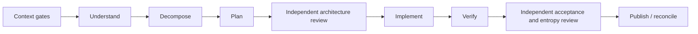

# Unified workflow contract

This contract defines the public control surface that replaces ZzzOps' separate
commands. It implements the design approved in [#430](https://github.com/david-rzepa/zzzops/issues/430)
and is the shared contract for its implementation children.

## Public surface

ZzzOps exposes one public operation:

```text
zzzops workflow --intent <capture|execute|approve|resume|inspect> [intent input]
```

The installed skills remain the discoverable entry points for agents. Each skill
calls `workflow` with its appropriate intent; no skill tells an agent to invoke a
private operation. `workflow` always evaluates current repository, policy, goal,
provider, and lease evidence. It does not keep a workflow cursor. Caches may
avoid repeating unchanged reads, but cached output is never authority.

Current public command groups become private handlers behind that operation:

| Current public intent | Private handler family |
| --- | --- |
| `init`, `installation`, `checkpoint`, `portfolio` | context and policy gates |
| `goal` | goal capture, inspection, transition, and adoption |
| `reserve` | storage locks and phase leases |
| `entropy` | entropy evidence and review records |
| `diagnostics`, `report`, `coaching`, `feedback` | bounded diagnostics and reporting |

The legacy named commands are removed from the agent-facing interface when the
unified command ships. Internal handlers remain independently testable and may
be called only by `workflow`. The cutover inventory is exact: `init`
(`inspect`, `validate`, `apply`, `confirm`); `installation` (`status`, `audit`,
`record`); `entropy` (`list`, `observe`, `resolve`, `review status`, `review
mark`, `review plan`, `review complete`); `diagnostics` (`list`, `suggest`);
`portfolio`; `goal` (`create`, `transition`, `migrate-open`, `inspect`,
`reconcile-merged`); `reserve` (`acquire`, `renew`, `release`); `coaching`
(`attribute`); `report` (`record`, `list`); and `feedback` (`prepare`,
`submit`).

## Response envelope

Successful standard output contains only this versioned action envelope:

```json
{
  "schema_version": 1,
  "next_steps": [
    {
      "id": "policy-review",
      "skill": "$review-zzzops-policy",
      "intent": "inspect",
      "audience": "root",
      "phase": "context",
      "action": "Inspect the stale policy and prepare the explicit approval input.",
      "reason": "Available model inventory changed since the recorded review."
    }
  ]
}
```

`next_steps` is an ordered DAG frontier, so independent items may be returned
together. Every item has a unique stable `id`, an installed skill reference, an
intent from `capture`, `execute`, `approve`, `resume`, or `inspect`, an audience,
a phase, imperative action prose, and the evidence-backed reason it is currently
required. A step may additionally name its goal, required model and effort,
lease, dependency IDs, or an opaque log reference when that information is needed
to act. The response never emits a generic instruction that requires the agent
to infer which skill to read or which workflow intent to invoke.

Standard output contains no diagnostics, timing, full portfolio, or tool logs.
Those go to a bounded local log artifact; a next step may reference that artifact
only when inspecting it is necessary to resolve the step. Errors use the same
envelope with an actionable repair step whenever a safe repair exists.

`skill` is a validated installed skill ID, never a free-form hint. The workflow
owns this registry and rejects a response whose step is not mapped to a currently
installed skill. It selects the indicated intent of that skill, which in turn
invokes the one public CLI command:

| Condition or action | Required skill | Workflow intent |
| --- | --- | --- |
| Capture a goal or record an out-of-scope entropy goal | `$add-zzzops-goal` | `capture` |
| Bootstrap or re-bootstrap policy/context | `$bootstrap-zzzops-repository` | `inspect` |
| Review stale policy, model inventory, or default DAG | `$review-zzzops-policy` | `inspect` |
| Validate an installed package | `$validate-zzzops-installation` | `inspect` |
| Adopt eligible open state | `$migrate-to-zzzops` | `inspect` |
| Dispatch, recover a lease, transition, verify, or publish | `$execute-zzzops` | `execute` |
| Resume an existing worker or phase | `$execute-zzzops` | `resume` |
| Explicitly approve goal design | `$execute-zzzops` | `approve` |
| Perform independent acceptance and entropy review | `$review-zzzops-entropy` | `execute` |
| Inspect agentic-engineering evidence and recommendations | `$review-agentic-engineering` | `inspect` |
| Inspect policy-authorized backlog suggestions | `$suggest-zzzops-work` | `inspect` |
| Prepare or submit opt-in product feedback | `$send-zzzops-feedback` | `execute` |

The registry is versioned with the plugin manifest and is part of the response
validation surface. If an action has no installed-skill mapping, the workflow
returns a root-audience repair step to install or repair the package; it never
emits an unmapped action.

## Evidence-derived phases

The reviewed project policy declares one reusable phase DAG. The shipped default
uses the following nodes; policy may tune requirements and edges through
declarative building blocks, not executable handlers or a per-goal DAG.



Each phase records its declared input evidence, the hash of that evidence, its
output artifact hash, selected model and effort, actor, verification evidence,
and any `not_required` decision. Phase eligibility is recomputed from this
record and live evidence on every invocation. There is no mutable phase cursor.

A changed required input makes that phase stale. The coordinator reassesses the
phase before invalidating downstream work. If the reassessment produces a
byte-identical artifact, it updates the input record and preserves downstream
validity. Policy changes stale every phase of open goals; closed goals are not
rewritten or hydrated. If a closed goal later reopens, the then-current policy
and evidence make stale phases visible.

`Understand` is the root-owned boundary for user questions, capability
assessment, goal-design approval, and routing decisions. A direct root skill is
required for every human-facing step because only the root can ask or receive
user input. `Decompose` may be marked not required for an atomic goal. Parent
goals own understanding, decomposition, shared contracts, and aggregate review;
all source implementation belongs to child goals. A child may plan after parent
decomposition and implementation waits for parent planning and architectural
review.

`Independent architecture review` is mandatory before consequential
implementation. Policy decides when a goal is consequential and may mark the
node not required only for a bounded atomic change. Its record names an actor
independent of the plan author, the reviewed plan and evidence hashes, decision,
findings, and the policy rule that allowed implementation. A child cannot pass
its implementation edge until the parent or child record supplies that approved
review artifact.

`Verify` runs the declared narrow and required checks. `Review` is mandatory and
is performed by an actor independent of the implementation author. It combines
acceptance review and entropy review: fix an in-scope, non-expanding rot finding
in the current PR; otherwise create an entropy goal immediately. Only
correctness or safety blocks the current PR.

## Routing and delegation

The root assesses the required capability for every phase with the reviewed
decision tree. The tree maps relevant dimensions, including consequence and
decision boundedness, to the shipped tiers: Routine, Bounded, Reasoning, and
Architectural. A reviewed tier mapping selects the least-cost available
`(model, effort)` pair that satisfies that phase. New models or efforts outside
the reviewed inventory make policy review stale.

The root records the routing comparison and either dispatches a worker with the
selected pair or records why it retains work. A worker never asks the user,
changes canonical goal state, approves, publishes, or delegates recursively.
Work that needs human input stays with the root. A root-capability task runs at
the root; a more capable model or root-level parallelism needs the policy's
recorded default or an explicit per-session user override. Missing delegation
capability is itself an actionable root step, never silent sequential fallback.

Workers may be resumed for adjacent phases or fix cycles when their previous
context remains useful. Every resume rechecks current evidence, routing, and
lease ownership. Deterministic CLI calls and copying a response do not justify a
separate worker.

## Canonical evidence and handoff

Every phase input hash is `sha256` of a versioned, UTF-8 canonical JSON envelope:
object keys sort lexicographically, arrays retain declared order, and no
insignificant whitespace is included. The envelope names the phase and contains
the goal-spec digest; effective policy and phase-DAG digest; relevant parent and
dependency artifact references and hashes; repository, branch, PR, and provider
snapshot; discovered capability and model/effort inventory; required invocation
inputs; and upstream output hashes selected by the DAG edge. The policy declares
which snapshot fields each phase consumes, so irrelevant provider changes do not
invalidate it.

An output artifact has an immutable reference and `sha256` of its exact bytes
(or the provider's immutable content identity where bytes are unavailable). The
phase record separately stores input hash, output hash, verification hash,
routing hash, and review hash. Downstream phase inputs consume upstream output
hashes, never a mutable phase record. Re-recording changed inputs with the same
output bytes therefore preserves downstream validity; a changed output hash
invalidates only its declared descendants.

Workers return a bounded `phase_result` to the root: schema version, goal and
phase IDs, renewable lease ID and generation, input hash, output reference and
hash, verification evidence, selected `(model, effort)`, and opaque log
reference. A worker cannot write it into canonical state. `workflow` verifies
the current lease generation, route, and evidence freshness, then atomically
records the result or returns a recovery next step. This is the sole worker
handoff and reconciliation interface.

## Approval, leases, and batches

Policy/bootstrap validation gates every intent, including goal capture. When a
goal design needs approval, `workflow` returns a root-audience next step for the
approval skill; the caller must explicitly invoke `workflow --intent approve`.
Child decomposition within an approved parent scope needs no extra user approval.

Canonical goal storage uses short atomic update locks. Phase work uses persisted,
renewable leases that can be read across machines. Only a direct `workflow`
invocation acquires a lease. It creates a local heartbeat helper with a local
liveness probe and binds the worker after dispatch; the backend never executes a
stored command. Uncertain renewal or expiry enters recovery and requires an
explicit, evidence-backed decision before duplicate work starts.

Independent transitions may be requested in one batch. The response reports one
result per item and rejects dependent items before mutation. It is fail-fast for
the invalid item while preserving already confirmed independent results.

## Publication and adoption

The reviewed default permits isolated implementation in parallel, but publication
is a linear PR stack. Before a PR advances, the coordinator validates that it
rebases onto the current stack tip and has no side branch. Agents resolve rebases
and conflicts; the CLI validates topology and emits the next repair step.

Adoption is bounded and lossless. Open goals and policy state gain the minimum
evidence needed to derive phases; old evidence is preserved. Closed goals are
read only for minimal terminal metadata and are never migrated, hydrated, or
rewritten. Reopening a closed goal makes normal adoption rules apply.

## Representative decisions

| Situation | Required next step |
| --- | --- |
| Policy digest or model inventory changed | Root runs `$review-zzzops-policy`; no goal action proceeds first. |
| No capability assessment for a phase and a human answer is needed | Root runs `$add-zzzops-goal` or the relevant workflow skill to capture the answer and approval. |
| An implementation phase has a valid plan, route, and lease | Root dispatches the named worker with recorded `(model, effort)`. |
| Evidence changes but plan output is byte-identical | Re-record evidence hashes and continue without unnecessary replanning. |
| A lease heartbeat becomes uncertain | Root runs the workflow recovery next step; it does not start another worker. |
| Acceptance finds out-of-scope entropy | Create a separate goal through `$add-zzzops-goal` and continue unless correctness or safety requires a block. |
